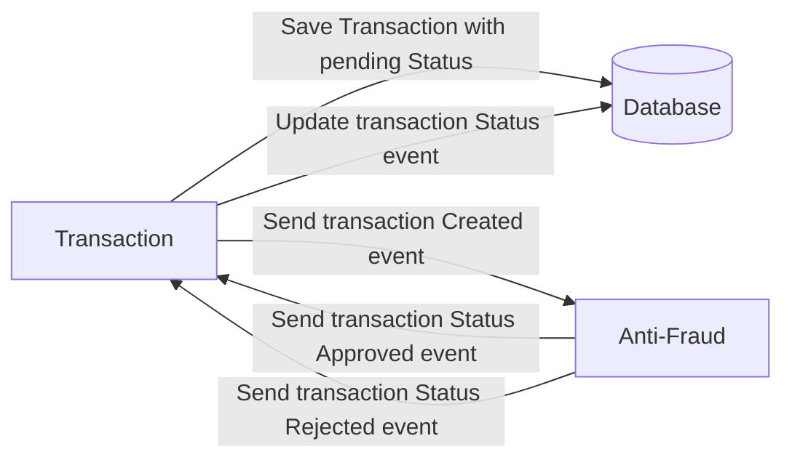

# Yape Code Challenge :rocket:

Our code challenge will let you marvel us with your Jedi coding skills :smile:.

Don't forget that the proper way to submit your work is to fork the repo and create a PR :wink: ... have fun !!

- [Yape Code Challenge :rocket:](#yape-code-challenge-rocket)
- [Problem](#problem)
- [Tech Stack](#tech-stack)
  - [Optional](#optional)
- [Send us your challenge](#send-us-your-challenge)
- [Solution Challenge](#solution-challenge)
  - [Instructions for compile](#instructions-for-compile)
    - [1. Installation](#1-installation)
    - [2. Config .env](#2-config-env)
    - [3. Run containers in the background](#3-run-containers-in-the-background)
    - [4. Run project (Only if you used docker-compose.yml)](#4-run-project-only-if-you-used-docker-composeyml)
    - [5. Check swagger documentation in http://localhost:3000/api](#5-check-swagger-documentation-in-httplocalhost3000api)
    - [6. Check graphql documentation in http://localhost:3000/graphql](#6-check-graphql-documentation-in-httplocalhost3000graphql)
  - [Troubleshooting](#troubleshooting)
  - [ Postman: Colección y Entornos](#-postman-colección-y-entornos)
    - [Ubicación de los archivos](#ubicación-de-los-archivos)
  - [GraphQL API Usage](#graphql-api-usage)
    - [Crear transacción](#crear-transacción)
    - [Actualizar una transacción](#actualizar-una-transacción)
    - [Obtener una transacción por id](#obtener-una-transacción-por-id)
    - [Obtener transacciones con paginación y filtros](#obtener-transacciones-con-paginación-y-filtros)

# Problem

Every time a financial transaction is created it must be validated by our anti-fraud microservice and then the same service sends a message back to update the transaction status.
For now, we have only three transaction statuses:

<ol>
  <li>pending</li>
  <li>approved</li>
  <li>rejected</li>  
</ol>

Every transaction with a value greater than 1000 should be rejected.



# Tech Stack

<ol>
  <li>Node. You can use any framework you want (i.e. Nestjs with an ORM like TypeOrm or Prisma) </li>
  <li>Any database</li>
  <li>Kafka</li>    
</ol>

We do provide a `Dockerfile` to help you get started with a dev environment.

You must have two resources:

1. Resource to create a transaction that must containt:

```json
{
  "accountExternalIdDebit": "Guid",
  "accountExternalIdCredit": "Guid",
  "tranferTypeId": 1,
  "value": 120
}
```

2. Resource to retrieve a transaction

```json
{
  "transactionExternalId": "Guid",
  "transactionType": {
    "name": ""
  },
  "transactionStatus": {
    "name": ""
  },
  "value": 120,
  "createdAt": "Date"
}
```

## Optional

You can use any approach to store transaction data but you should consider that we may deal with high volume scenarios where we have a huge amount of writes and reads for the same data at the same time. How would you tackle this requirement?

You can use Graphql;

# Send us your challenge

When you finish your challenge, after forking a repository, you **must** open a pull request to our repository. There are no limitations to the implementation, you can follow the programming paradigm, modularization, and style that you feel is the most appropriate solution.

If you have any questions, please let us know.

# Solution Challenge

## Instructions for compile

### 1. Installation

```bash
$ yarn install
```

A default option and an alternative option (option 2) are presented, choose the one that suits you best.

- Default option: Default option: Dockerize services and project run outside of docker
- Alternative option (option 2): Dockerize entire project

### 2. Config .env

Create a .env file in the root of the project and place all the keys that appear in it .env.example and complete theys values

```
# docker-compose.yml
DB_TYPE=postgres
DB_HOST=localhost
DB_PORT=
DB_USER=
DB_PASSWORD=
DB_NAME=
KAFKA_CLIENT_ID=transaction-service
KAFKA_BROKER="localhost:9092"
```

or

option 2: Dockerize the entire project (In DB_HOST use name service of databse when dockerize entire project)

```
# docker-compose.dev.yml
DB_TYPE=postgres
DB_HOST=postgres
DB_PORT=
DB_USER=
DB_PASSWORD=
DB_NAME=
KAFKA_CLIENT_ID=transaction-service
KAFKA_BROKER="kafka:29092"
```

### 3. Run containers in the background

Inicialize docker client

```bash
$ docker-compose -f docker-compose.yml up -d
```

or option 2: use docker-compose.dev.yml to dockerize the entire project

```bash
$ docker-compose -f docker-compose.dev.yml up -d
```

### 4. Run project (Only if you used docker-compose.yml)

```bash
# development
$ yarn run start

# watch mode
$ yarn run start:dev

# production mode
$ yarn run start:prod
```

### 5. Check swagger documentation in http://localhost:3000/api

### 6. Check graphql documentation in http://localhost:3000/graphql

## Troubleshooting

If you had this message when trying to launch the project with step 4

```
ERROR [TypeOrmModule] Unable to connect to the database. Retrying (2)...
    error: ������������ "admin" �� ������ �������� ����������� (�� ������)
        at Parser.parseErrorMessage
```

Make sure you don't have any resource conflicts.
Solve fix: Please uninstall postgress if you have it installed on your PC and cannot resolve the resource conflict.

```bash
$ psql --version
```

If installed, you will see something like:

```scss
psql (PostgreSQL) 14.4
```

Check if it is active:

```bash
$ service postgresql status
```

Check ports:

```bash
$ netstat -an | grep 5432
```

More info about fix, check: https://stackoverflow.com/questions/73906739/nestjs-app-cant-connect-to-postgresql-docker-container

## [](#) Postman: Colección y Entornos

### Ubicación de los archivos

- **Colección y variables de entorno Postman**: [postman/](./postman/)

## GraphQL API Usage

Este proyecto expone un API GraphQL. A continuación, se muestran ejemplos de queries y mutaciones que puedes utilizar.
http://localhost:3000/graphql

### Crear transacción

```graphql
mutation createTransaction($inputCreate: CreateTransactionDTO!) {
  createTransaction(input: $inputCreate) {
    createdAt
    transactionExternalId
    transactionType {
      name
    }
    transactionStatus {
      name
    }
    value
  }
}
```

Variables:

```json
{
  "inputCreate": {
    "accountExternalIdDebit": "32a1c938-4882-4dcd-9746-f57d9c96b3db",
    "accountExternalIdCredit": "4444c938-4882-4dcd-9746-f57d9c96b3db",
    "transferTypeId": "BANK_TRANSFER",
    "value": 100.5
  }
}
```

### Actualizar una transacción

```graphql
mutation patchTransaction($id: String!, $inputPatch: PatchTransactionDTO!) {
  patchTransaction(id: $id, input: $inputPatch) {
    createdAt
    transactionExternalId
    transactionType {
      name
    }
    transactionStatus {
      name
    }
    value
  }
}
```

Variables:
Reemplazar el valor de id por un el transactionExternalId que retorne la query createTransaction()

```json
{
  "id": "f86157d5-6ef2-49f1-b2ba-be490655673d",
  "inputPatch": {
    "transactionStatus": "APPROVED"
  }
}
```

### Obtener una transacción por id

```graphql
query getTransaction($id: String!) {
  getTransaction(id: $id) {
    transactionExternalId
    transactionType {
      name
    }
    transactionStatus {
      name
    }
    value
    createdAt
  }
}
```

Variables:

```grapql
{
  "id":"f86157d5-6ef2-49f1-b2ba-be490655673d"
}
```

### Obtener transacciones con paginación y filtros

```graphql
query getTransactions($inputFilter: GetTransactionsInputDTO) {
  getTransactions(input: $inputFilter) {
    limit
    page
    totalCount
    data {
      transactionExternalId
      transactionType {
        name
      }
      transactionStatus {
        name
      }
      value
    }
  }
}
```

Variables:

```grapql
{
  "inputFilter":{
    "offset": 0,
    "limit": 5,
    "filters": {
      "transactionStatus": "APPROVED"
    }
  }
}
```
